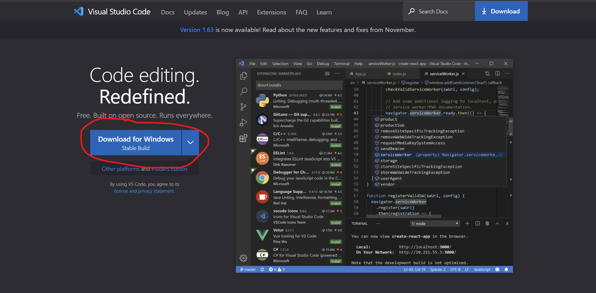
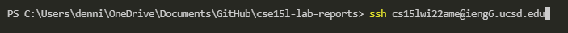
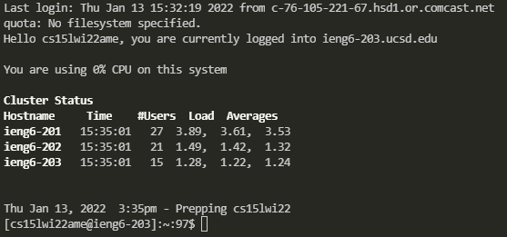
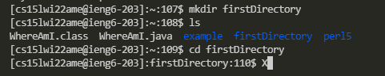
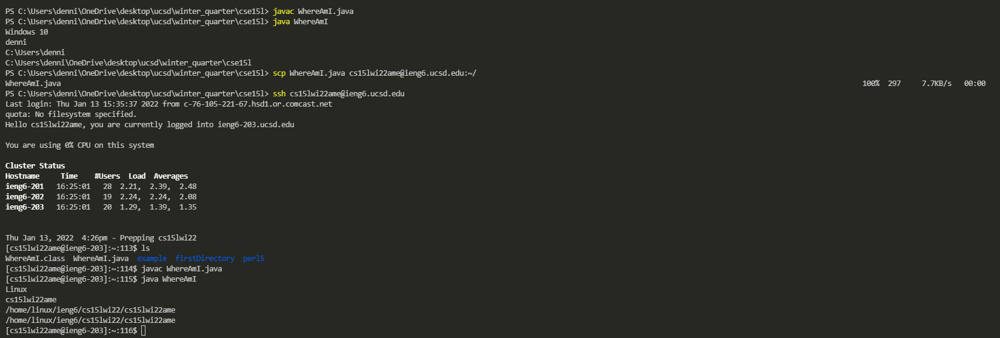
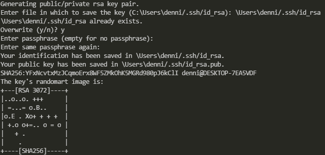
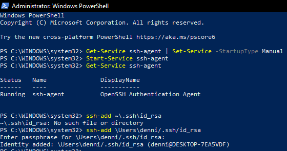
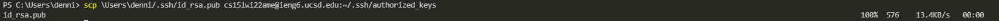
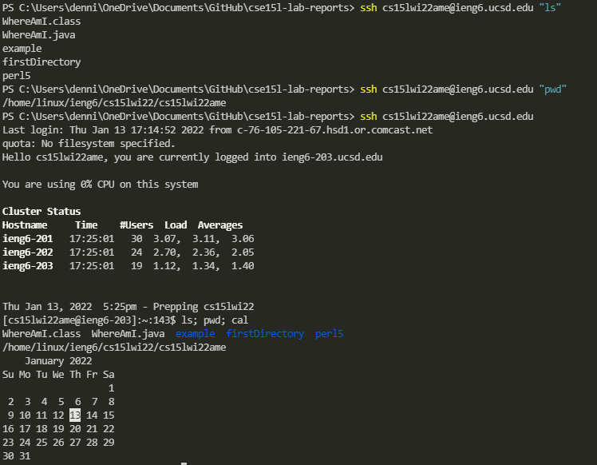

# Week 2 Lab Report
January 14th, 2022

Last Updated: January 13th, 2022 by Dennis Liang

---


## Installing VScode
1. Go to https://code.visualstudio.com/

2. Download the appropriate version of Visual Studio Code (VSCode) for your computer
3. After opening VSCode, it should look similar to image below


## Remotely Connecting
1. To securely access computer over the internet we need to use Secure Shell (SSH). Download and intall OpenSSH from [here](https://docs.microsoft.com/en-us/windows-server/administration/openssh/openssh_install_firstuse)
2. Go to https://sdacs.ucsd.edu/~icc/index.php to check your login information
3. Open a terminal in VSCode and enter your login information as asked

4. You will be prompted to confirm you want to conintue connecting, enter "yes"
5. Then enter your password. Keep in mind that your password will not show up on the screen.

6. Congrulation you have just logged in!


## Trying Some Commands
Below are some commands to try out. The terminal is a command line interface as oppose to the graphical interface we are used to using.

mkdir: make directory
```
mkdir firstDirectory
```
ls: list files
```
ls
```
cd: change directory
```
cd firstDirectory
```

Your results should be something like the follwing


To exit you can use either commmand
* ctrl-d
* exit


## Moving Files with scp
When you log in, you are using the ieng6 computer. To transfer file from your computer to ieng6, you need to use the scp command.

1. Create the following file on your local computer and name it WhereAmI.java
```
class WhereAmI {
  public static void main(String[] args) {
    System.out.println(System.getProperty("os.name"));
    System.out.println(System.getProperty("user.name"));
    System.out.println(System.getProperty("user.home"));
    System.out.println(System.getProperty("user.dir"));
  }
}
```
2. Compile and run the file using javac and java to see the results.
3. Next use the following command to transfer the file to your ieng6 directory. Keep in mind to replace the ending bit with your own username.
```
scp WhereAmI.java cs15lwi22zz@ieng6.ucsd.edu:~/
```
4. Enter your password when the terminal prompts you to do so.
5. Proceed to log onto ieng6 and use ls to see if your file is there
6. Compile and run the file and compare the results with the earlier step
The whole process should look like this.



## Setting an SSH Key
Having to type in your password when you login and transfer file can be time consuming. SSH keys allow the client and host to recognize each other, forgoing having to manually type in password.
1. Enter the following command and follow the prompt
```
ssh-keygen
```
2. Depending on your system such as Windows, you may need to perform extra steps outlined [here](https://docs.microsoft.com/en-us/windows-server/administration/openssh/openssh_keymanagement#user-key-generation)
3. Next copy the public key to the .ssh directory of your user acount on the server. Replace the login information with your own.
```
ssh cs15lwi22zz@ieng6.ucsd.edu
mkdir .ssh
exit
scp \Users\denni/.ssh/id_rsa.pub cs15lwi22ame@ieng6.ucsd.edu:~/.ssh/authorized_keys
```
4. The entire process should look like this.








## Optimizing Remote Running
Several commands are available to make using command line interface and remote access easier.
Here are some commands to try out
- While on your local computer the following command allows you to log in and list the files in your account's home directory
```
ssh cs15lwi22amd@ieng6.ucsd.edu "ls"
```

- To run multiple commands, simply seperate the commands with a semicolon

Here are some examples


---
This was a summary of the week 1 lab setup process. For more information go to [here](https://ucsd-cse15l-w22.github.io/week/week1/)


