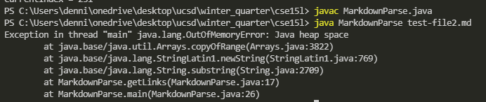

# Week 4 Lab Report
January 27th 2022

Last Updated: January 27th, 2022 by Dennis Liang

## Fixing Bugs
### Bug 1


[Link][https://github.com/dennisliang01/markdown-parse/blob/2eb2f9720c0811a0807159a4b0526fab0b1d006c/test-file2.md] to failure inducing test file.

Symptom


The bug is caused by the file having more text after the link which causes the currentIndex to be stuck. This causes and infinite loop which eventually breaks the program. The porgram does not display anything because it keeps running.


---

### Bug 2


[Link][] to failure inducing test file.

Symptom
```

```

---

### Bug 3


[Link][] to failure inducing test file.

Symptom
```

```
---
