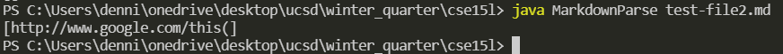

# Week 4 Lab Report
January 27th 2022

Last Updated: January 27th, 2022 by Dennis Liang

## Fixing Bugs
### Bug 1


[Link][https://github.com/dennisliang01/markdown-parse/blob/164a14b8a68b439ac981942f0a83614a4e069945/test-file-2.md] 
to failure inducing test file.

Symptom


The bug is caused by the file having parentheses inside the link which broke the pattern that the program is designed to read. This caused an infinite loop where the counter was stuck at one number such as 108.


---

### Bug 2


[Link][https://github.com/dennisliang01/markdown-parse/blob/164a14b8a68b439ac981942f0a83614a4e069945/test-file-2.md] 
to failure inducing test file.

Symptom


The bug is caused by the same file as bug 1 but this time the bug is causing the file to not show the complete url. This is caused by having parenethese in the url which makes the program stop prematurely.

---

### Bug 3


[Link][] to failure inducing test file.

Symptom
```

```
---
