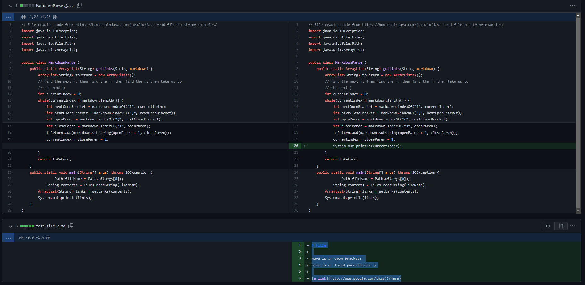
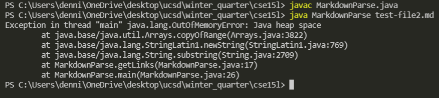
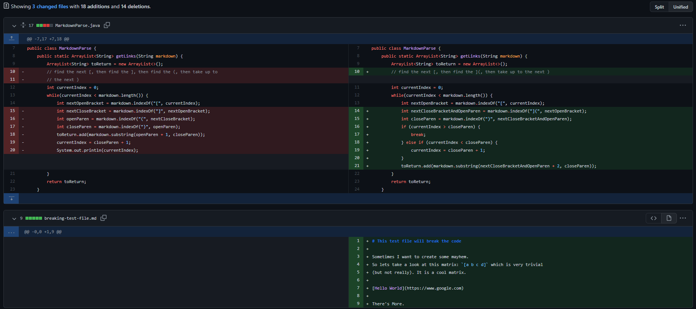
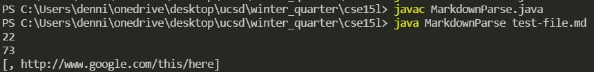
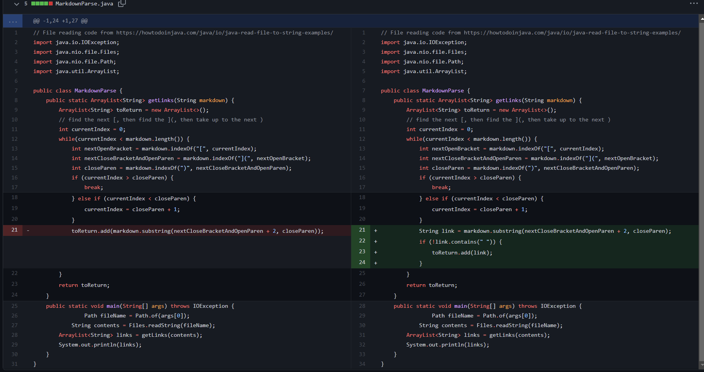
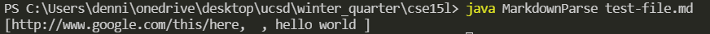

# Week 4 Lab Report
January 27th 2022

Last Updated: January 27th, 2022 by Dennis Liang

## Fixing Bugs
### Bug 1

[Link](https://github.com/dennisliang01/markdown-parse/blob/164a14b8a68b439ac981942f0a83614a4e069945/test-file-2.md) to failure inducing test file.

Symptom

The bug is caused by the file having parentheses inside the link which broke the pattern that the program is designed to read. This caused an infinite loop where the counter was stuck at one number such as 108.

---

### Bug 2

[Link](https://github.com/dennisliang01/markdown-parse/blob/main/breaking-test-file-2.md) to failure inducing test file.

Symptom

The bug is caused having a disconnected square bracket and parenthese which causes the program to incorrectly treat the parenthese as a link. There is an invalid link entry in the list.

---

### Bug 3

[Link](https://github.com/dennisliang01/markdown-parse/blob/main/breaking-test-file-3.md) to failure inducing test file.

Symptom

Sometimes link brackets could be empty or have invalid inside. The symptom is that invalid links were also being inserted into the list. URLs do not have spaces.

---
